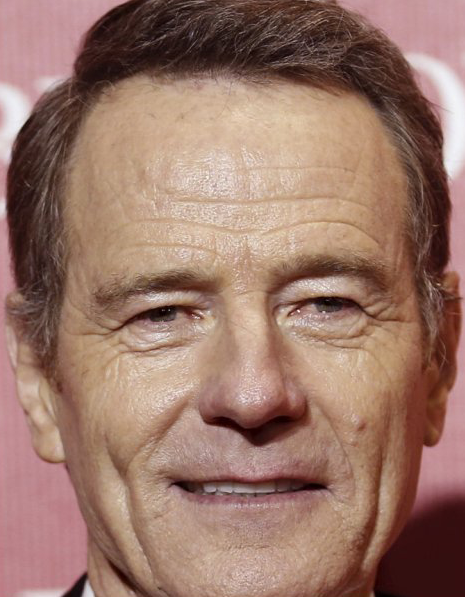

# <black> Let's play a little game! 
## <black> Try to find matching pairs of the nominees for the acting academy award of 2016!
  <title>Memory Game</title>
  <link rel="stylesheet" href="styles.css">
  <section class="memory-game">
    

      
      
    
  

      
      
    
  

      
      
    
  

      
      
    
  

      
      
    
  

      
      
    
  

      
      
    
  

      
      
    
  

      
      
    
  

      
      
    
  

      
      
    
  

      
      
    
  

      
      
    
  

      
      
    
  

      
      
    
  

      
      
    
  

      
      
    
  

      
      
    
  

      
      
    
  

      
      
    

  </section>
  

# <black> Why was this so easy?

## <black> Because all the nominees for the acting academy award of 2016 were white.

# <black> So what is this about?
After in 2015 all 20 oscar acting nominations were awarded to white people, the [#OscarsSoWhite](https://mobile.twitter.com/search?q=%23oscarssowhite) hastag, criticising the lack of diversity and calling for changes in the film industry, went viral.

But should the film industry comply with these demands purely for ethical reasons, or does the film industry benefit from a more diverse cast also from a capitalistic point of view? To investigate whether a more diverse cast attracts a larger audience and thus achieves more financial success, we examine the box office revenue of the films in the ["CMU Movie Summary Corpus"](http://www.cs.cmu.edu/~ark/personas/) dataset. To avoid sparsity of data and to add further interesting features that go beyond the CMU dataset, we also add the ["The Movies Dataset"](https://www.kaggle.com/datasets/rounakbanik/the-movies-dataset). As a measure of diversity, we focus mainly on ethnicity, gender, and age. In particular, we are interested in whether moviegoers' acceptance or rejection for movies with a more diverse cast has changed over the last 100 years. Since movies produced in the US have the biggest audience and make by far the most money, we'll restrict our analysis to those movies.

# <black> And why should we care?
## <black> 1) Financial reasons
The movie business is a multi-billion-dollar industry, therefore it would be very beneficial to know what sells and what does not. 

## <black> 2) Societal relevance
Diversity is one of the most controversial topics of our time. However, the discussions about this are mostly based on feelings and subjective impressions. An analysis based on data should lead to a more objective assessment of this contentious subject. And since movies can be seen as a reflection of their time, the results of our analysis could act as an indicator for changes and advancements in society over time.

# <black> This leads us to our research questions...

## <black> Let's talk about money:
In this paragraph we examine general changes regarding the movie industry over time.
The following plot shows that the actual value of 1 US-dollar changed dramatically between 1900 and 2022. Therefore, we have to take inflation into account, to be able to compare the movie box offices across different decades.
  

With the inflation adjusted box office revenue shown in the next plot, it can be seen that the rise of revenue over time is not as significant as it initially seems.
  


In the subsequent plots, we can also see that the budget of movies has increased over time. Compared to the box office revenue, we can see that the budget is increasing faster, which implies that the ratio between budget and revenue is actually slightly decreasing.
  

  

Another interesting question would be how big the share of really sucessful movies is compared to the overall number of movies. The following plot delivers the answer and shows that the vast majority of released movies do not generate a huge amount of box office revenue.
  

  
The number of movie releases increased drastically in the last 100 years as depicted in the following plot. This implies that the movie industry is a growing market.
  

##	<black> Which characteristics of movies are correlated with the movie box office revenue?

It seems logical that the box office revenue is correlated with many characteristics of movies. The most obvious one, would be the influence of the movie budget on the box office revenue. Indeed, while not directly related, the budget influences other characteristics of movies such as more sophisticated visuals and more famous cast, which usually leads to more popular movies. A higher budget tends to lead to a higher gross. We can also see that the public perception of a movie which is getting represented through the TMDB vote counts and vote averages slightly correlates with the box office. A movie which is getting perceived as a good movie is making more money than a movie which is getting perceived as a bad movie.
 
As we can see in the plots below, other variables like gender, actor ethnicities etc. seem to have an influence on the box office revenue as well, which we will explore in more detail in the rest of this datastory.
  

Another important movie characteristic is the genre. Over the decades the distribution of the most popular genres changed.
  


## <black> Let's talk about diversity:
First we have to clarify here, what diversity is. Wikipedia says that "Diversity as seen in sociology and political studies is the degree of differences in identifying features among the members of a purposefully defined group, such as any group differences in racial or ethnic classifications, age, gender, religion, philosophy, physical abilities, socioeconomic background, sexual orientation, gender identity, intelligence, mental health, physical health, genetic attributes, personality, behavior or attractiveness" [1]. In our analysis we focus on racial and ethnic classsifications, gender, and age. 

##	<black> Does ethnical diversity correlate with the box office revenue?
In order to answer this question, we have to clarify first how we confine different races and ethnicities. Since we examine only US-american movies, we adapt the racial and ethnical categories of the US census [2].

Following this definition, there exist the six following racial categories: 

  1) White

  2) Black or African American

  3) Asian

  4) American Indian or Alaska Native

  5) Native Hawaiian or Other Pacific Islander

  6) Other (e.g Aboriginal or Indigenous Australian)

For ethnicities, there exist the following two categories:

  1) Hispanic or Latino

  2) Not Hispanic or Latino

To avoid sparsity of data, we neglect the differentiation between the different ethnicities (Hispanic or Latino and Not Hispanic or Latino). At this point, we would like to mention that throughout this datastory we use the term "ethnicity" instead of the US-american term "race".
 
##	<black> Did ethnical diversity in movies change over time?
  
The following plots depict the distribution of the different ethnicities of the movie characters for the most successful movies from each decade in our dataset. In this case, the most successful movies are defined as the ten movies with the highest box office revenue in the decade. As we can see, the vast majority of movie characters in every decade is white, and the dominance of white characters has its peak in the 1950s. To get more insights about the distribution of minorities, you can click in the subsequent plot on the white_ratio label to hide it. Then it is clearly visible that the second most represented racial group is Black or African American. Since the 1970s, there appears to be an increase of the diversity among the minorities.
  


The previous plot gave us an insight about ethnical diversity importance among the top movies of each decade, but what we really want to know is whether increasing diversity will lead to a box office revenue increase. We can show this with the following plot, showing ethnical diversity against box office revenue. The regression lines show that, while minor, an increased white people ratio will lead to a decrease in box office revenue while an increased black african american ratio will lead to an increase in box office revenue. From the lack of representation of the other ethnical minorities, it is harder to make a statement about their influence on the box office revenue.

##	<black> Did the gender ratio of the cast in movies change over time?
The following plot demonstrates the gender distribution of the movie cast for each decade. As we can see, the distribution was nearly even in the 1910s and then changed in favor of a male superiority, which had its peak in the 1970s. Since then the share of female actors in the cast is slightly increasing. However, the distribution in the 2010s is still 2:1 in favor of males.
    

 ### But what about the influence of the gender ratios on revenue? 
Talking about the most successful movies, it appears that male dominated casts tend to generate slightly more box office revenue compared to female dominated casts. The regression plot below illustrates this fact.
  

  
It is interesting to note that although this visualization shows a clear trend, other statistical visualizations such as the following paired test contradict these findings, and shows that while it was significantly worse to have a higher female ratio before the 1950s, it has since become significantly positive in order to generate higher earnings to have a higher female ratio after 2010.
For this reason, we must always be careful when presenting findings that look significant at first glance.
  

  
## <black> Did the age distribution of actors in movies change over time?
The following plot demonstrates the evolution of the age distribution of movie actors over the decades. As we can see, in the early 1900s, it seems actors were mostly young early adopters. The mean of actors then steadily increase with time, as if the same group of actors grew together. New young actors joining in may be the reason that the mean increase is not quite linear. Since the 1960, the age distribution has stopped going up and seems to have stabilized. Therefore, we can conclude that in the regard of age, diversity increased over time.
  

  
# <black> Discussion
Although we showed some trends indicating that diversity may sometimes be beneficial, there are any more confounders influencing box office revenue. Below, we present a causal diagram we believe represents a good part of these confounders. In general, the movie studio and its budget have a big influence on the main elements that directly influence box office revenue.
  

# <black> Conclusion
Does diversity pay off? 
We would say yes, especially in more recent times where people have become more aware of the importance of diversity in a more general way. Diversity in the context of ethnicities and age seems to be improving. However, there are still further improvements to be made, especially in the context of diverse gender representation. 

# <black> Now try it out yourself!
[Play around with different movie characteristics and see how they affect the box office!](https://matt989253-ada-2022-project-b0b-machine-learning-website-tjfnoq.streamlit.app/)
  
# <black> References
[1] [https://en.wikipedia.org/wiki/Diversity_(politics)](https://en.wikipedia.org/wiki/Diversity_(politics))

[2] [https://en.wikipedia.org/wiki/Race_and_ethnicity_in_the_United_States](https://en.wikipedia.org/wiki/Race_and_ethnicity_in_the_United_States)

# <black> Roll the Credits!
Written and directed by b0bEast (Colin Pelletier, Matthieu Burguburu, Jan Henke, Hendrik Schillinger)
  
Produced as part of the course [Applied Data Analysis (CS-401)](https://dlab.epfl.ch/teaching/fall2022/cs401/) at EPFL in Fall 2022
  
The script can be found [here](https://github.com/epfl-ada/ada-2022-project-b0beast)
